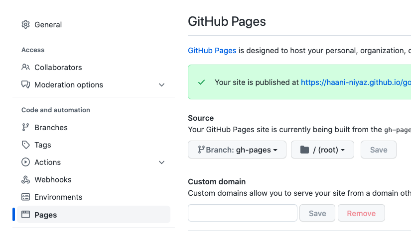

# mkdocs-material

## What

[mkdocs-material](https://squidfunk.github.io/mkdocs-material/) provides documentation in Markdown to create a professional static site in minutes – searchable, customizable, for all devices.

## Why

From a developer experience perspective, it is easier to clone and have everything you need to reference locally rather than having to externally reference something i.e Github wiki, Confluence etc.

This minimises context switching and aids the practice of keeping documentation updated as it is closer to the codebase.

## How

The repository is preconfigured with a `./docs` directory and renders all markdown files to generate a `github-pages` site.

`mkdocs-material` is customizable via the `mkdocs.yml` configuration file available in the repository root directory. The configuration present is not exhaustive and can be further [customized](https://squidfunk.github.io/mkdocs-material/reference/).


## CI setup

### Github pages

A mkdocs workflow is configured to automatically run on the `main` branch, however it requires github-pages to be enabled in the repository settings.

See the screenshot below:



The documentation contained within the `./docs` directory will be automatically published and accessible via `<org>.github.io/<repository>.`

### Site name

Update `site_name` field in `./mkdocs.yml` file to set the main title for the project documentation.


## Local setup

```bash
pip install mkdocs-material
```

For more installtion options see [here](https://squidfunk.github.io/mkdocs-material/getting-started/).

Run a local server to preview docs:

```bash
mkdocs serve
```
